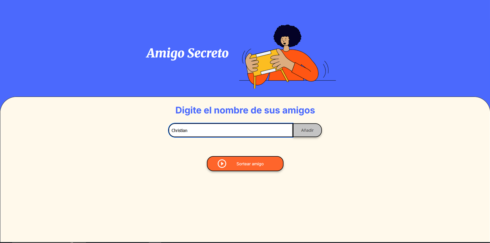
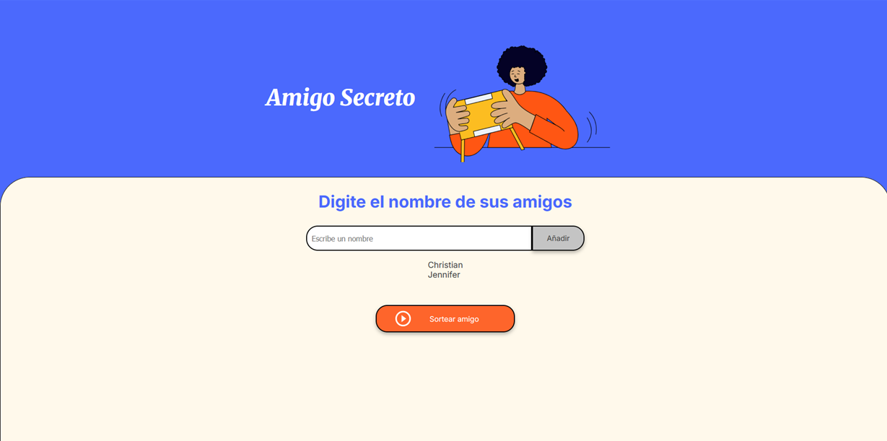
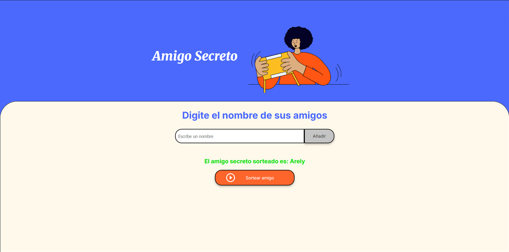

# Challenge Amigo Secreto

## Descripción

"Amigo Secreto" es una aplicación web sencilla desarrollada en JavaScript, HTML y CSS, que permite agregar nombres de participantes y realizar un sorteo aleatorio para asignar un "amigo secreto".

Este proyecto forma parte del programa ONE de Alura Latam y el objetivo es validar los conocimientos del curso Principiante en Programación.

## Funcionalidades

- Agregar nombres a la lista de participantes.
- Validar si el campo de nombre está vacío y mostrar un mensaje para ingresar un nombre.
- Ver la lista de participantes agregados.
- Validar que haya al menos 2 nombres antes de realizar el sorteo.
- Realizar el sorteo aleatorio de un amigo secreto.
- Mostrar el resultado del sorteo.

## Capturas de Pantalla

### 1. Agregar Nombres

El usuario ingresa nombres y los añade a la lista:



### 2. Lista de Participantes

La lista muestra los nombres agregados:



### 3. Realizar el Sorteo

Una vez agregados los nombres, el usuario puede sortear un amigo secreto:



## Tecnologías Utilizadas

- **HTML**: Estructura del proyecto.
- **CSS**: Estilos y diseño.
- **JavaScript**: Lógica de la aplicación.

## Instalación y Uso

1. Clona el repositorio:
   ```bash
   git clone https://github.com/ChrisSaes/challenge-amigo-secreto.git
   ```
2. Abre el archivo `index.html` en tu navegador.
3. Ingresa los nombres y realiza el sorteo.

## Contribución

Si deseas contribuir, puedes enviar un pull request o reportar problemas en la sección de Issues.

## Autor

Proyecto desarrollado por **Christian Saldana** como parte del programa **ONE - Alura Latam**.
